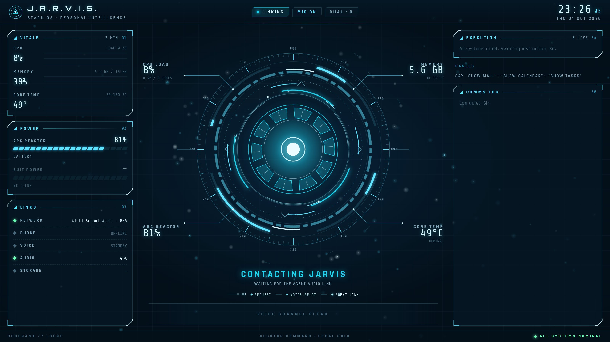
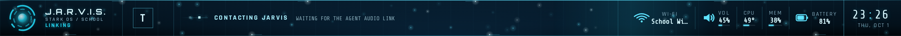
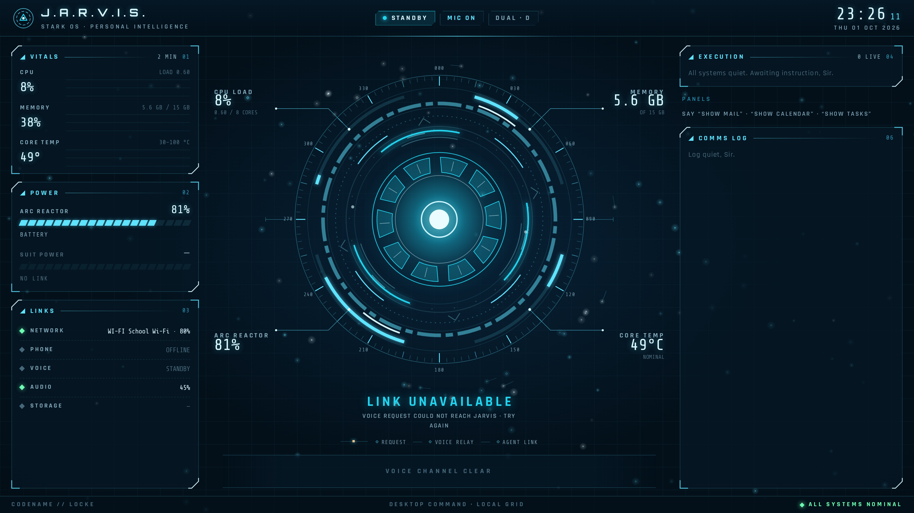

# Voice connection choreography

The existing STARK reactor now acquires the voice link with layered orbital arcs,
inward pulses, and light packets. The school bar uses the same connection state
with a compact signal ribbon. Existing ambient particles and school transitions
are retained. No animation delays microphone capture, joining, or playback.

The local Numpad Enter request paints immediately in either face. Backend wake
steps then control the labels and completed-stage markers:

| Observed event | Presentation |
| --- | --- |
| Local request; wake/capture/transcribe/verify | Acquiring the request |
| check/auth/connect/uplink | Establishing the voice link |
| dispatch | Contacting Jarvis; awaiting the agent audio link |
| online | Voice link established; brief decorative resolve |
| Setup cleared | Return to standby |
| Summon command rejected | Link unavailable; retry available |
| No local acknowledgement for 10 seconds | Awaiting confirmation; retry available |
| No new setup stage for 45 seconds | Checking link; no recent connection update |

The `online` event proves an agent audio-track subscription, **not model readiness
or first audible audio**. The resolve lasts 1.1 seconds without delaying the actual
call state. A quiet established call has no perpetual joining indicator. There are
no time-based percentages or invented TLS/model initialization substeps.

A hung summon can be retried; a late rejection from an older request cannot replace
a newer request's state. An observed pending room stays pending when its boot log
expires. A fresh webview that first sees an older room without any boot history
still has the existing backend-contract ambiguity; this UI does not establish
model readiness from that condition.

The reticle uses whole SVG transform/opacity layers; there is no new JavaScript
animation loop or per-frame React update. Native SVG resolution, existing particle
DPR and quality remain intact. Hidden, offscreen, and transition-owned reticles
pause. Reduced motion retains the static stage/readiness presentation. Menu hit
targets remain above decorative layers.

## Validation

- Production export and TypeScript check passed. Two pre-existing unrelated
  visualizer lint warnings remain; changed production files pass ESLint.
- 37 frontend Node tests passed, including 8 new phase/generation tests.
- Headless Chromium at DPR 2 exercised immediate response, duplicate key presses,
  real stage changes, a dispatch older than 15 seconds, expired pending boot,
  generation changes, quiet calls, backend clear, local failure, hanging native
  requests and retries, late obsolete rejection, hidden/offscreen pause, reduced
  motion, school continuity, and actual calendar menu interaction.
- Ambient regression checks passed at DPR 1 and 2, including pause/resume,
  reduced motion, menu clipping and control hit targets. All 7 existing school
  transition scenarios passed, including slow/blocked monitor hops and reversals.
- All native IPC and bridge responses were mocked. No real room, microphone,
  desktop action, or model call was used. This validates presentation and lifecycle
  behavior, not physical end-to-end audio latency or native GPU frame pacing.

Run after `pnpm build`:

```sh
node --test tests/*.test.cjs
# From jarvis_new:
uv run --no-sync python frontend/tests/voice-link-smoke.py
```






